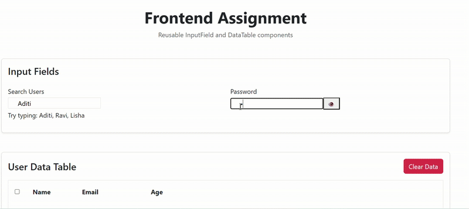

Frontend Assignment – InputField & DataTable

This project implements two reusable components, an InputField and a DataTable, using React, Vite, and TypeScript. The InputField supports labels, helper text, error states,
and an optional password toggle, while the DataTable displays tabular data with row selection and a clear data action.

Setup-
Clone the repository and install dependencies:
git clone https://github.com/apoorvanagari/frontend-assignment.git
cd frontend-assignment
npm install
npm run dev

The app will run at http://localhost:5173/.

Approach-
The components were designed to be reusable and modular. The InputField handles common input scenarios with flexibility for future extensions, while the DataTable provides a 
simple structure for displaying and interacting with data. The goal was to keep the implementation clean, maintainable, and easy to integrate into larger applications.

Deployment-
The project is deployed on Vercel:
[deployed](https://frontend-assignment-demo-beta.vercel.app/)
storybook - [https://frontend-assignment-ashen-theta.vercel.app/](https://frontend-assignment-ashen-theta.vercel.app/?path=/docs/configure-your-project--docs)

Demo-
Here is a quick demo of the components in action:

